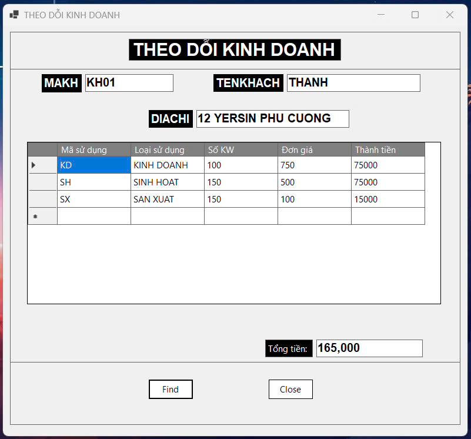

# Electricity_Business_Management
A simple electric company management system

- This Windows Forms app, built with C# and .NET, manages electricity usage for customers. 
- Users select a customer ID from a dropdown, click "Find" to retrieve and display customer details (name, address) and usage data (type, KW, unit price, total) in a DataGridView. The app calculates the total electricity cost and displays it. 
- Data is stored in a SQL Server database (QuanLyDien) with tables for customers(KHACHHANG), usage(SUDUNG), and details(CHITIET).

